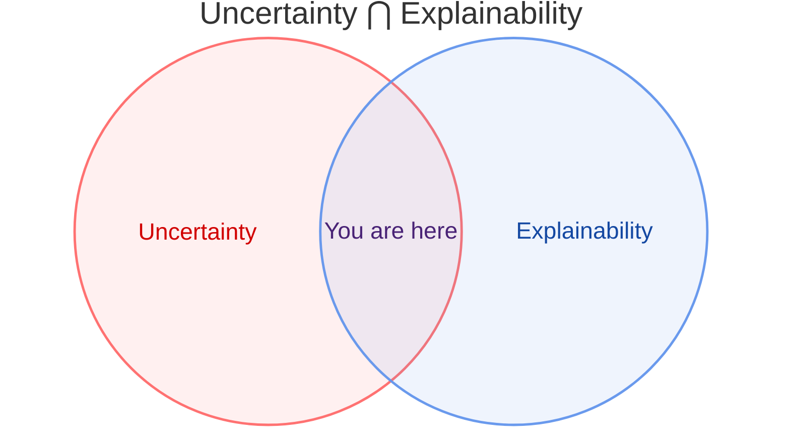

# 
`Awesome Uncertainty Meets Explainability`

  

  

---
⛰️ **A collection of papers and codes for uncertainty in explainability and explainability for uncertainty. We are continuously contributing to this repository to make it always follows the newest trend.**

## Overview

 

## Uncertainty in explainability
Bayesian method ◼️; Ensemble method 🔶; Conformal prediction 🔷; Perturbation-based method 🟣; Evidential DL method 🔴; Distributional attribution 🔺; Survey 📖
- Slack D, Hilgard A, Singh S, Lakkaraju H. Reliable post hoc explanations: Modeling uncertainty in explainability. Advances in neural information processing systems. 2021 Dec 6;34:9391-404. [link](https://proceedings.neurips.cc/paper_files/paper/2021/hash/4e246a381baf2ce038b3b0f82c7d6fb4-Abstract.html) ◼️
- Cifuentes S, Bertossi L, Pardal N, Abriola S, Martinez MV, Romero M. The distributional uncertainty of the shap score in explainable machine learning. arXiv preprint arXiv:2401.12731. 2024 Jan 23. [link](https://arxiv.org/abs/2401.12731) 🔺
- Chiaburu T, Haußer F, Bießmann F. Uncertainty in xai: Human perception and modeling approaches. Machine Learning and Knowledge Extraction. 2024 May 27;6(2):1170-92. [link](https://www.mdpi.com/2504-4990/6/2/55#Modeling_Uncertainty_in_XAI) 📖
- Löfström H, Löfström T, Johansson U, Sönströd C. Calibrated explanations: With uncertainty information and counterfactuals. Expert Systems with Applications. 2024 Jul 15;246:123154. [link](https://arxiv.org/abs/2305.02305) 🔷
- Wickstrøm KK, Brüsch T, Kampffmeyer MC, Jenssen R. Repeat: Improving uncertainty estimation in representation learning explainability. InProceedings of the AAAI Conference on Artificial Intelligence 2025 Apr 11 (Vol. 39, No. 8, pp. 8341-8350). [link](https://ojs.aaai.org/index.php/AAAI/article/view/32900) 🟣
- Chiaburu T, Bießmann F, Haußer F. Uncertainty propagation in xai: A comparison of analytical and empirical estimators. InWorld Conference on Explainable Artificial Intelligence 2025 Jul 9 (pp. 390-411). Cham: Springer Nature Switzerland. [link](https://arxiv.org/abs/2504.03736) 🔺
- Zhu C, Bounia L, Nguyen VL, Destercke S, Hoarau A. Robust Explanations Through Uncertainty Decomposition: A Path to Trustworthier AI. arXiv preprint arXiv:2507.12913. 2025 Jul 17. [link](https://arxiv.org/html/2507.12913v1) ◼️
- Idrissi MI, Machado AF, Gallic E, Charpentier A. Unveil sources of uncertainty: Feature contribution to conformal prediction intervals. arXiv preprint arXiv:2505.13118. 2025 May 19. [link](https://arxiv.org/abs/2505.13118) 🔷
- Lou X, Luo P, Li Z, Gao S, Meng L. GeoXCP: uncertainty quantification of spatial explanations in explainable AI. International Journal of Geographical Information Science. 2025 Nov 25:1-31. [link](https://www.tandfonline.com/doi/full/10.1080/13658816.2025.2574900) 🔷

## Explainability for uncertainty
- Yapicioglu FR, Stramiglio A, Vitali F. Conformasight: Conformal prediction-based global and model-agnostic explainability framework. InWorld Conference on Explainable Artificial Intelligence 2024 Jul 10 (pp. 270-293). Cham: Springer Nature Switzerland. [link](https://link.springer.com/chapter/10.1007/978-3-031-63800-8_14)
- Löfström H, Löfström T, Szabadvary JH. Ensured: Explanations for decreasing the epistemic uncertainty in predictions. arXiv preprint arXiv:2410.05479. 2024 Oct 7. [link](https://arxiv.org/html/2410.05479)
- Cheng X, Wang T, Zhu D, Ma J. Uncertainty explanation of artificial intelligence models by SHAP. Knowledge-Based Systems. 2026 Jan 31:115437. [link](https://www.sciencedirect.com/science/article/pii/S0950705126001802)